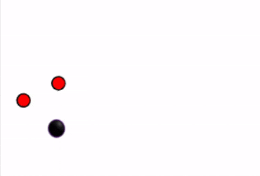

# C++ Ball Machine Chamber Library
This is a C++ library for creating WASM ball machine chambers that can be uploaded to https://sphaerophoria.dev/

It is compatible with the [Ball Machine Chamber API](https://github.com/sphaerophoria/ball-machine) and was made as an easy way to start writing chambers in C++.



## Install Emscripten
```bash
git clone https://github.com/emscripten-core/emsdk.git
cd emsdk
./emsdk install latest
./emsdk activate latest
```
Activate path variables:
```bash
source ./emsdk_env.sh
```
## Building
```bash
# Optionally build with examples
emcmake cmake -B build -DCHAMBER_BUILD_EXAMPLES=ON
cmake --build build
```

## License

This project is licensed under the BSD 2-Clause - see the [LICENSE](LICENSE) file for details.
